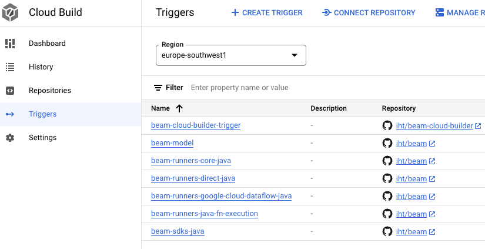

# Custom Apache Beam builds in Google Cloud

The scripts in this repo will build the Apache Beam Java SDK packages, using Cloud Build and
Artifact Registry, for a personal Beam fork.

This repo contains Terraform code to setup Cloud Build and Artifact Registry, to build and publish
custom Apache Beam packages, for testing and development purposes, in a private package repository.
For instance, if you want to contribute a pull request to Apache Beam, but you would like first to
use your code with your own pipelines, this makes it easier to publish and use those custom packages
with your pipelines, before submitting the pull request.

The Terraform code assumes that you have your repo in Github.

## Pre-requirements

To use this custom builds, you need the following:

- A project in Google Cloud
- A fork of the [Apache Beam repository](https://github.com/apache/beam)
- A fork of the [Beam Cloud Builder repo](https://github.com/iht/beam-cloud-builder)

You can use the Cloud Shell to run this Terraform code. Alternatively, if you prefer to use your
local computer, you will need to install and configure the following dependencies:

- Google Cloud SDK: <https://cloud.google.com/sdk/docs/install-sdk>
- Terraform >= 1.5.1: <https://developer.hashicorp.com/terraform/install>

## Create the build triggers and package repositories

### Step 1

Link your Github forks (`beam` and `beam-cloud-builder`) with Cloud Build. This is a manual step
that cannot be done using Terraform. Follow the instructions given at:

- <https://cloud.google.com/build/docs/automating-builds/github/connect-repo-github>

**Use 1st generation repository linking with Cloud Build**. The Terraform code will not work with
2nd generation repository linking.

### Step 2

Create a file named `terraform.vars` with the following content:

```hcl
beam_repo = "beam"
container_repo = "beam-cloud-builder"
github_owner = "<YOUR GITHUB USERNAME>"
project_id = "<YOUR GOOGLE CLOUD PROJECT ID>"
region = "<A CLOUD BUILD REGION ID>"
```

For the Cloud Build region id, choose one from the list of supported locations.

- <https://cloud.google.com/build/docs/locations>

For instance, to run your builds in the Madrid region, use `europe-southwest1`.

### Step 3

Run the Terraform code. In the shell (e.g. Cloud Shell), run the following commands:

```shell
terraform init
terraform apply
```

Review the changes that the code will make in your Google Cloud project and snswer `yes` when
prompted.

Make sure you are authenticated in Google Cloud with an user or service
account that has enough permissions to enable the Cloud Build and Artifact Registry APIs, and to
create the repositories and triggers.

When this step is completed, go to the list of triggers and choose the build region:

- <https://console.cloud.google.com/cloud-build/triggers>

You should see a list of triggers like the following:



### Step 4

Run the Beam Cloud Builder trigger to publish the container image that is used to build Beam. Use
the branch `main` from the image fork. You can run the trigger manually, or use the following
command in the shell (e.g. Cloud Shell):

```shell
gcloud builds triggers run --region=<YOUR CLOUD BUILD REGION> --branch=main beam-cloud-builder-trigger
```

That will publish an image in the builder Artifact Registry Repo. You can check the images in the
repo `beam-build-docker` in Artifact Registry:

- <https://console.cloud.google.com/artifacts>

This steps is a pre-requirement for the rest of the builds to work correctly.

## How are builds triggered?

The builds will listen to changes in any branch of any of the forks. Any time you push changes to
any of the branches of your repo, the lates (new) commit of each branch will built.

The packages are published with the following version number pattern:

- `X.XX.X-<SHORT COMMIT ID>-SNAPSHOT`

For instance:

- `2.55.0-8a74a1c2-SNAPSHOT`

So every time you are writing to a branch in your fork, with the idea of later sending a pull
request, you will be able to easily identify what packages correspond exactly to your changes
(branch and short commit id).

You can also try to run some of the triggers manually, using the branch `master` (the main branch
in the Apache Beam repo), to make sure everything is working correctly.

## How can I use the published packages?

If you have `gcloud` configured in the same project, you can some commands to get the settings for
Gradle and Maven. If you are in the Cloud Shell, `gcloud` is already configured for you.

Run the following commands first:

```shell
gcloud config set artifacts/repository
gcloud config set artifacts/location <YOUR CLOUD BUILD REGION>
```

For **Gradle settings**, run and copy the output in your `build.gradle` file:

```shell
gcloud artifacts print-settings gradle
```

For **Maven settings**, run and copy the output in your `pom.xml` file:

```shell
gcloud artifacts print-settings mvn
```

There are more detailed instructions in the Artifact Registry documentation:

- <https://cloud.google.com/artifact-registry/docs/java>

## How to undo all the changes?

If you want to remove all the changes done by these scripts, you can run the following command:

```shell
terraform destroy
```

**WARNING: this will remove all the packages and containers** published in the Artifact Registry
repositories. You will not be able to recover those packages and containers.
